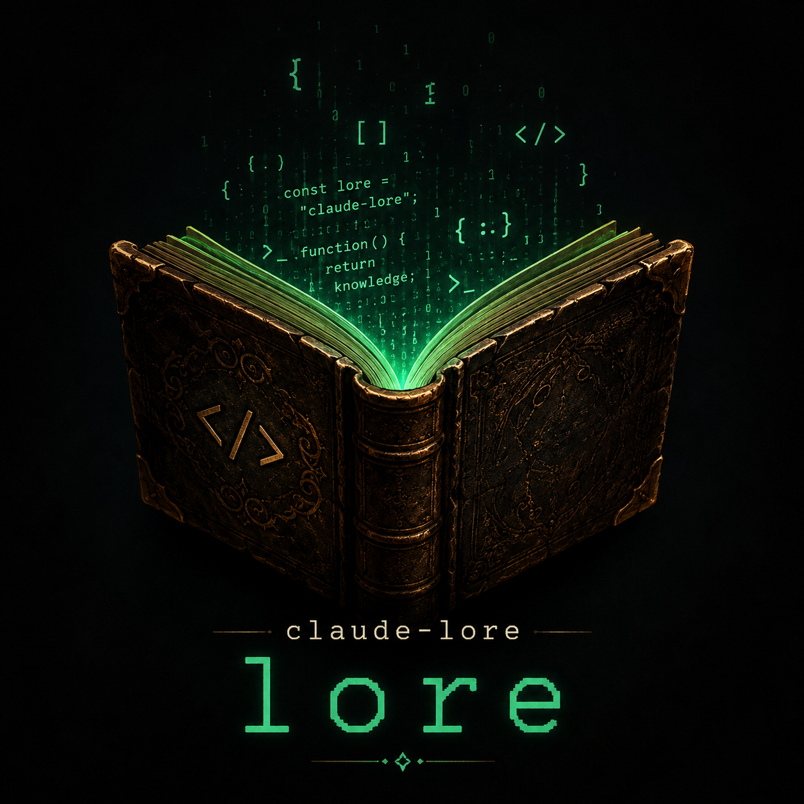

# claude-lore

<p align="center">
  
</p>

<p align="center">
  A persistent, git-versioned knowledge base for Claude Code projects —<br/>
  wiki, auto memory, and coding discipline inspired by <a href="https://x.com/karpathy/status/2015883857489522876">Andrej Karpathy</a>.
</p>

<p align="center">
  <a href="https://github.com/tiagosilva07/claude-lore/blob/main/LICENSE"></a>
</p>

---

Andrej Karpathy published a pattern ([gist](https://gist.github.com/karpathy/442a6bf555914893e9891c11519de94f)) for building persistent, compounding knowledge bases: instead of re-synthesizing raw sources on every query, an LLM incrementally builds and maintains a cross-linked wiki of markdown files. Knowledge compounds over time rather than evaporating after each session.

> *"The tedious part...is the bookkeeping."* LLMs handle cross-references, consistency, and updates at near-zero cost, while humans focus on curation and direction.

Great pattern. But applying it to a coding workflow requires tooling — organizing captures, maintaining structure, keeping it updated across sessions.

`claude-lore` is that tooling, built for Claude Code projects.

**The pattern (Karpathy's idea):**

| Operation | What it does |
|-----------|-------------|
| **Ingest** | One source triggers updates across multiple wiki pages |
| **Query** | Read index → find relevant pages → synthesize answers |
| **Lint** | Periodic health-checks: contradictions, stale claims, orphan pages |

**The implementation (claude-lore):**

| Command | Maps to |
|---------|---------|
| `/lore-init` | Scaffold the wiki structure and schema (`CLAUDE.md`) |
| `/lore-capture` | Ingest — save decisions, bugs, patterns to the inbox during coding |
| `/lore-ingest` | Compile captures into cross-linked wiki pages, commit to git |

**What you get:**
- Private wiki (outside your repo)
- Git-versioned knowledge base that compounds over time
- Easy-to-use Claude Code plugin
- Auto memory and coding discipline guidelines included

Karpathy showed the idea works. `claude-lore` makes it easy to actually do it.

---

> *"LLMs are exceptionally good at looping until they meet specific goals... Don't tell it what to do, give it success criteria and watch it go."*
> — Andrej Karpathy

---

## Install

### Option A — Claude Code Plugin (recommended)

Open Claude Code and run:

```
/plugin marketplace add tiagosilva07/claude-lore
```

Then install the plugin:

```
/plugin install claude-lore@lore
```

Then initialize it in your project:

```
/lore-init
```

That's it. The wiki and memory system are ready.

---

### Option B — Manual

**1. Add the guidelines to your project:**

```bash
# New CLAUDE.md
curl -o CLAUDE.md https://raw.githubusercontent.com/tiagosilva07/claude-lore/main/CLAUDE.md

# Append to existing CLAUDE.md
curl https://raw.githubusercontent.com/tiagosilva07/claude-lore/main/CLAUDE.md >> CLAUDE.md
```

**2. Install the slash commands:**

```bash
mkdir -p ~/.claude/commands

curl -o ~/.claude/commands/lore-init.md \
  https://raw.githubusercontent.com/tiagosilva07/claude-lore/main/skills/lore-init/SKILL.md

curl -o ~/.claude/commands/lore-capture.md \
  https://raw.githubusercontent.com/tiagosilva07/claude-lore/main/skills/lore-capture/SKILL.md

curl -o ~/.claude/commands/lore-ingest.md \
  https://raw.githubusercontent.com/tiagosilva07/claude-lore/main/skills/lore-ingest/SKILL.md
```

**3. Initialize your project:**

```
/lore-init
```

---

## Usage

| Step | Command | When |
|------|---------|------|
| **1. Setup** | `/lore-init` | Once per project |
| **2. Capture** | `/lore-capture` | During a conversation, when something worth keeping comes up |
| **3. Compile** | `/lore-ingest` | To turn inbox captures into cross-linked wiki pages |

---

## What it does

### Knowledge wiki

Captures durable knowledge from conversations into a git-versioned wiki:

- `/lore-init` — scaffold the wiki and memory system for the current project
- `/lore-capture` — save a decision, bug root cause, or lesson to the inbox
- `/lore-ingest` — compile inbox into cross-linked wiki pages, committed to git

The wiki lives at `~/.claude/projects/<project-slug>/lore/` — outside your repo so private notes stay private.

### Auto memory

A structured memory system at `~/.claude/projects/<project-slug>/memory/` that persists across sessions. Claude reads `MEMORY.md` at session start and writes typed memory files (user, feedback, project, reference) as it learns your preferences.

### Coding guidelines

Four principles that reduce common LLM coding mistakes:

1. **Think Before Coding** — surface assumptions, ask when uncertain, push back on overcomplication
2. **Simplicity First** — minimum code that solves the problem, nothing speculative
3. **Surgical Changes** — touch only what you must, clean up only your own mess
4. **Goal-Driven Execution** — define verifiable success criteria, loop until met

---

## Wiki structure

```
~/.claude/projects/<project-slug>/
  lore/
    index.md              ← read this first every session
    INGESTER.md           ← merge/create rules for the ingester
    inbox/                ← captures waiting to be compiled
    .pending/             ← in-flight during ingest (auto-managed)
    project/              ← platform status, product vision, roadmap
    architecture/         ← modules, data flows, technical design
    decisions/            ← ADRs: technology choices and tradeoffs
    feedback/             ← coding preferences, workflow rules
    user/                 ← user profile and working style
  memory/
    MEMORY.md             ← index, loaded every session
    *.md                  ← individual memory files
```

---

## What to capture vs. what to skip

**Capture:**
- A decision was made — what, why, what was rejected
- A bug was root-caused — the actual cause, not just the fix
- A pattern was identified in the codebase
- The user stated a preference or workflow rule
- An architectural choice was made with a tradeoff

**Skip:**
- What file was edited, what command was run
- In-progress task state
- Anything derivable from reading the code or `git log`

---

## Philosophy

The wiki system implements [Karpathy's persistent wiki pattern](https://gist.github.com/karpathy/442a6bf555914893e9891c11519de94f) — raw sources (conversations) feed an LLM that maintains a cross-linked wiki, compounding knowledge over time instead of re-deriving it from scratch each session.

The coding guidelines are inspired by [Karpathy's observations on LLM coding pitfalls](https://x.com/karpathy/status/2015883857489522876) — models that make silent assumptions, overcomplicate code, and touch things they shouldn't. The four principles address those pitfalls directly.

Claude Code's context window is ephemeral. Every new session starts cold. `claude-lore` gives Claude a persistent layer of *why* — why the architecture is shaped this way, why this library was chosen, why this approach was rejected.

The goal: a senior engineer opening this project for the first time — or Claude starting a new session — reads the lore wiki and understands not just *what* the code does, but *why* it was built this way.

---

## License

MIT
